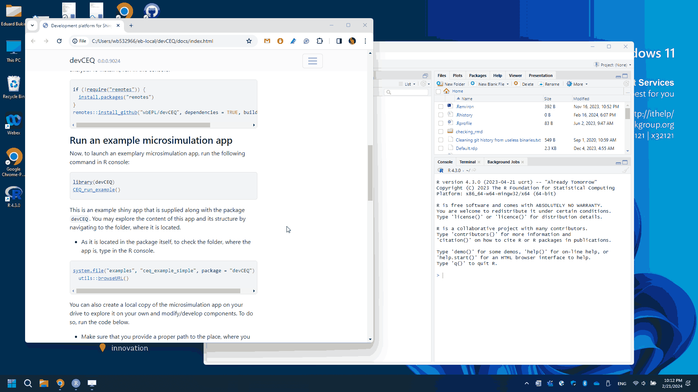

# **devCEQ**: Development platform for Shiny fiscal microsimulations

This R package contains standardized infrastructure for developing and deploying country-specific fiscal microsimulations as Shiny apps for the Poverty and Equity Policy Lab. The main goal of these apps is to provide users with the visual interface for executing complex microsimulations, and summarizing their results. 

There are several apps deployed using the **devCEQ** infrastructure: [Senegal CEQ 2018](https://datanalytics.worldbank.org/senceqapp2018/), [Côte d'Ivoire CEQ](https://datanalytics.worldbank.org/civCEQapp/), [Benin CEQ](https://datanalytics.worldbank.org/benCEQapp/), [Indonesia CEQ](https://datanalytics.worldbank.org/idnCEQ2019/). The **devCEQ** package evolved as a result of developing independent apps for [Armenia v1](https://datanalytics.worldbank.org/armCEQapp/) and [Armenia v2](https://datanalytics.worldbank.org/armenia-ceq/), [El Salvador](https://datanalytics.worldbank.org/el-salvador-fiscal-and-equity-tool/), [Turkey](https://datanalytics.worldbank.org/turkey-tax-simulation-tool/), and [Romania CEQ](https://datanalytics.worldbank.org/romania-sim-tool/), where various aspects and requirements to the application were tested at first.

Essentially, **devCEQ** R Package standardizes the data flow within the microsimulation and wraps it in a user interface. With this package, developers can customize the inputs page. Develop and embed any data and simulation methodology into the core of the microsimulation. Finally built a custom visualization either recycling existing modules or developing new ones for better results communication. 

An example of such an app is below.


## Getting started

### Pre-requisites

1.  It is expected that everyone is familiar with Stata, can independently run CEQ-like microsimulations in Stata, and change code to save different stages of the microsimulation analysis.

2.  Install the latest versions of [R](https://cran.r-project.org/bin/windows/base/), [Rtools](https://cran.r-project.org/bin/windows/Rtools/rtools43/rtools.html), and [R Studio](https://posit.co/download/rstudio-desktop/).

3.  Install [GitHub Desktop](https://desktop.github.com/) and familiarize yourself with the basics of workflow using Git and Github.

### Install `devCEQ` package 

This is very important as this package is the backbone of microsimulation analysis. To install it, run in the console:

```r
if (!require("remotes")) {
  install.packages("remotes")
}
remotes::install_github("wbEPL/devCEQ", dependencies = TRUE, build_vignettes = FALSE)
```

### Run an example microsimulation app

Now, to launch an exemplary microsimulation app, run the following command in the R console:

```r
library(devCEQ)
CEQ_run_example()
```



This is an example shiny app that is supplied along with the package `devCEQ`. You may explore the content of this app and its structure by navigating to the folder, where it is located.

-   As it is located in the package itself, to check the folder, where the app is, type in the R console.

```r
system.file("examples", "ceq_example_simple", package = "devCEQ") |> 
  utils::browseURL()
```

You can also create a local copy of the microsimulation app on your drive to explore it on your own and modify/develop components. To do so, run the code below. 

-   Make sure that you provide a proper path to the place, where you want this app to be created.
-   In the path argument specify a folder, where the app should be as well as the name of the app itself ("./FOLDER/AppName"). The function will create all folders automatically. 

```r
library(devCEQ)
create_microsim("./microsim_simple_example")
```

Template microsim app has the following structure, which we explore in detail in specific articles on app development.

```
../microsim_simple_example
├── app.R
├── data-app
│   └── simple-inputs-structure.xlsx
├── DESCRIPTION
├── inst
│   └── app
│       └── info-page.md
├── LICENSE
├── microsim_simple_example.Rproj
├── NAMESPACE
├── R
│   ├── app_config.R
│   ├── fct_simulation.R
│   ├── fct_variables.R
│   ├── mod_gini_povertyresults.R
│   ├── mod_inc_ncp.R
│   ├── mod_results.R
│   └── _disable_autoload.R
└── README.md
```

## The process of developing a microsimulation and its SHiny app

This guide/website is meant to equip users with the key skills they need for developing the user interface of the microsimulation tools in R Shiny. Follow tutorials in the consecutive order under the [Articles](./articles/index.html) above. Limited functional documentation is also available in [References](./reference/index.html). 

Overall, the process of microsimulation development consists of **two broad stages**:

1.  Developing a microsimulation in Stata (with Excel for data input/output) and polishing the simulation methodology to the dissemination-ready state.

2.  'Translating' the final Stata microsimulation into R, optimizing the analysis, and building a Shiny dashboard around it.

The first stage is not described here in detail, however, the article [Running microsimulations in Stata](./articles/microsim-stata.Rmd) contains some best practices for developing such microsimulations in Stata. Users are advised to follow examples from this article to set up properly the workflow of translating the microsimulation from Stata to R.

The second stage is the focus of this guide. In the second stage, the translation of Stata methodology into R is happening and the Shiny dashboard is created. This translation process has a few logical steps outlined below. Several articles are developed for each step. Please follow these articles to gradually reproduce examples and familiarize yourself with the translation process.

1.  Converting simulation methodology from Stata to R.

    1.  [Running microsimulations in Stata](./articles/microsim-stata.html)
    2.  [Setting up a workflow in R](./articles/r-workflow.Rmd)
    3.  Re-saving pre-simulation data in R
    4.  Translating Stata code to R and comparing results between R and Stata
    5.  Common R functions/approaches used for translating standard Stata commands 
    6.  Automating inputs provision in R
    
2.  Designing the input page of the dashboard.

    1.  Building inputs structure table and testing its layout in the app
    2.  Advanced topics: tabs, input sub-tables, checkboxes, and radio buttons

3.  Designing the output page (visualization page) of the dashboard

    1.  Defining key variables used in output building
    2.  Running exemplary visualization modules
    3.  Using Stata inputs to build a moc-up visualization page
    4.  Advances topics: customizing output visualization
    
4.  Integrating the input page, output page, and simulation logic in a single dashboard

<!-- 5.  Troubleshooting and improving the analysis. -->


