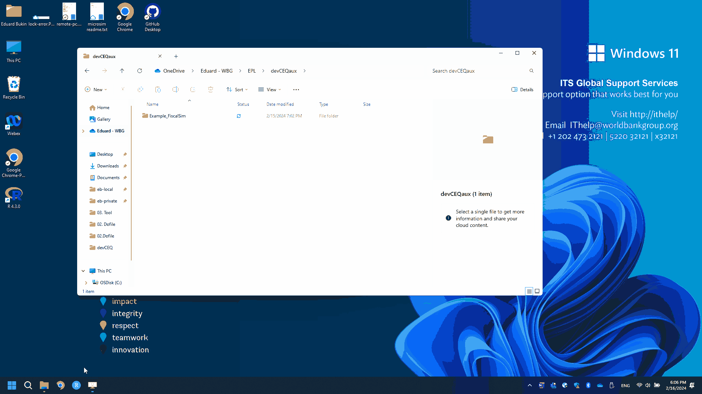

## Working directory

In one of the previous steps, we:

-   Created a folder for the project of translating a microsimulation `EPL/devCEQaux`.
-   Cloned example microsimulation in Stata from <https://github.com/wbEPL/Example_FiscalSim> to the folder `EPL/devCEQaux/Example_FiscalSim/`.

Now, we need to create a project for our analysis in R, which will subsequently become a place, where we develop our R Shiny application with the microsimulation.

### Creating an RStudio project

In your root folder, where you perform translation of the analysis to R and execute Stata code, (in this example, this is `EPL/devCEQaux` folder) create an R Studio project.

-   Familiarize with RStudio project basics here if needed [R4DS. Workflow: scripts and projects](https://r4ds.hadley.nz/workflow-scripts.html).
-   Use a short and concise name for the project. (It must not contain spaces and be short, up to 20 characters long).
    -   For example, use the same name as the Stata project has and add "\_app" to it. The result is: "Example_FiscalSim_app". In this way you will discriminate where is the original Stata project and where is the R version of it.
-   The result of creating the RStudio project `EPL/devCEQaux/Example_FiscalSim_app.` is the following folder structure:
    -   Note. In the R Studio project folder, there is a file `Example_FiscalSim_app.Rproj`. Double-clicking on this file will start R Studio for you.

The result is the following folder structure:

```{r eval=FALSE, include=FALSE, echo=FALSE}
fs::dir_tree("C:/Users/wb532966/OneDrive - WBG/EPL/devCEQaux")
```

```         
./EPL/devCEQaux
├── Example_FiscalSim
│   ├── 01.Data
│   │   └── ...
│   ├── 02.Dofile
│   │   └── ...
│   ├── 03.Tool
│   │   └── Example_FiscalSim.xlsx
│   └── README.md
└── Example_FiscalSim_app
    └── Example_FiscalSim_app.Rproj
```

### Organizing files in the R Project.

The general principles of file organization in the R project are:

-   `R` folder is only used for functions, not scripts.

-   `data-app` folder for data that is used inside the shiny app (input structure data file, pre-simulation data, and baseline simulation results).

-   `dev` folder is the one, where we place our scripts. Here we usually develop such scripts as re-saving pre-simulation data, performing manual quality assurance routines, and developing and validating the simulation code in R.

-   `inst/app` folder exists for the auxiliary shiny-app related files, such as `info-page.md` markdown document of the shiny app landing page.

In the root directory of an R project, there are:

-   `.gitignore` file relevant to git.

-   `project_name.proj` is the file used to launch R Studio in the current project.

-   `DESCRIPTION` internal file relevant to the R package development.

-   `app.R` key r script, from where we launch our shiny app.

Now, create the folder structure as suggested above (not the files). The result should roughly be the following:

```{r eval=FALSE, include=FALSE, echo=FALSE}
fs::dir_tree("C:/Users/wb532966/OneDrive - WBG/EPL/devCEQaux/Example_FiscalSim_app")
```

### Creating and saving the first script in R

Now, let us create the first scrip in R and save it under the name `example-script.R` in the `dev` folder. Try to follow the steps from the animation.


